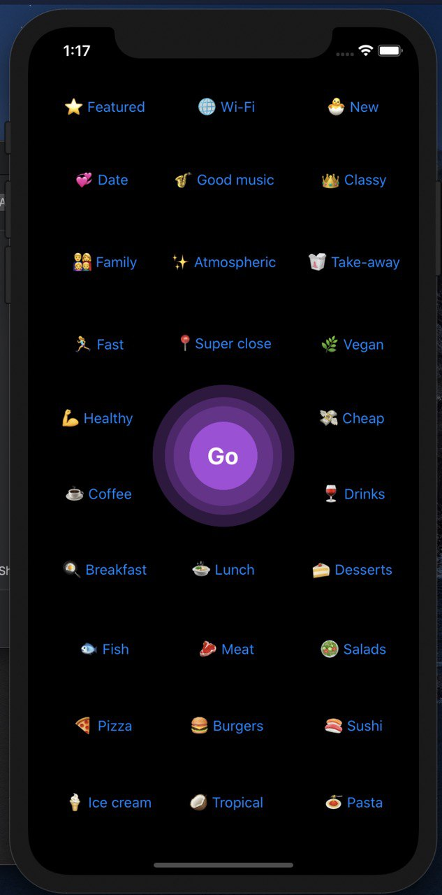

**Now** is an app which solves one of the most basic needs of a modern urban inhabitant: choose where to eat now. Instead of bewildering a user with a choice of hundreds of possible places, we provide one and only one place, based on the user location, global preferences, and local desires.

[Backend API description](https://docs.google.com/document/d/1aCDlV91YRMFD0wGvoKO6Bm_DTIPI6Io6y7GT9n03TJk/edit) (in Russian)

Team:

- [Ivan Grachyov](https://github.com/grachyov) &mdash; idea, mobile application (Swift)
- [Aleksandr Borzunov](https://github.com/borzunov) &mdash; backend (Python, Flask)
- [Arthur Liss](https://github.com/artli) &mdash; recommender system (Python, [Surprise](http://surpriselib.com/))
- [Nikolai Kruglikov](https://github.com/nkruglikov) &mdash; data scraping, backend (Python, Google Maps API)
